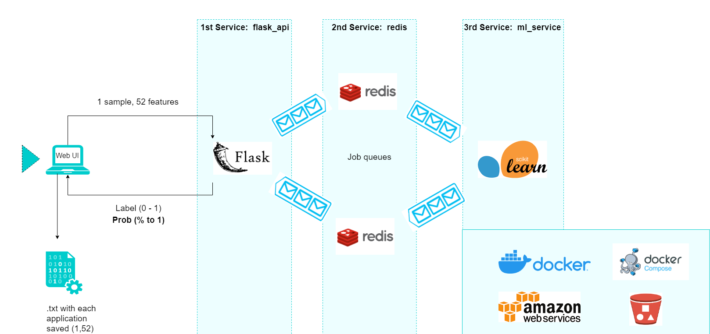

<p align="center" width="100%">
    
</p>

<p align="center">
    <a href="https://github.com/agusle/credit-risk-analysis-using-deep-learning/commits/main">
    
    <a href="https://github.com/agusle/credit-risk-analysis-using-deep-learning/issues">
    
    <a href="https://github.com/agusle/credit-risk-analysis-using-deep-learning/pulls">
    
</p>

<p align="center">
  <a href="#-about">About</a> •
  <a href="#-lets-play">Let´s play</a> •
  <a href="#-architecture">Architecture</a> • 
  <a href="#%EF%B8%8F-install-and-run">Install and Run</a> •
  <a href="#-usage">Usage</a> •
  <a href="#-contribute">Contribute</a> •
</p>

------------------

## 📖 About
- **Problem**: Binary classification with the aim of predicting risky credit operations.

In this particularly case I classified **if a credit applicant is creditworthy** analyizing its personal and  financial data to predict if is going to repay a loan on time. It is considered that an applicant have defaulted on its debt if it does not pay within 60 days of the due date so in this case will label with 0 those that are solvent and with 1 those that are not.

- **Industries**: fintech, banks, logistics, delivery apps, insurtech, many others related. 

- **Solution**:
Determine whether a new loan applicant will be able to repay their debt or not. Manipulated and visualized data, performed data pre-processing for a very small dataset of 50,000 applicants. Trained many supervised models like Random Forest, Boosting ensemble learning with LightGBM, XGBoost and CatBoost, and Stacked ensemble
learning with Soft Voting and Stacked models achieving +0.64 ROC AUC. Compared that result against a Deep Learning neural network like a Multilayer perceptron. Deployed in AWS instances using Docker and also using API-based web-service application with Flask.

You can see detailed information in the following **reports**: 
- [Exploratory Data Analysis](https://github.com/agusle/credit-risk-analysis-using-deep-learning/blob/main/reports/Data_exploratory_report.md) 
- [Modeling](https://github.com/agusle/credit-risk-analysis-using-deep-learning/blob/main/reports/Modeling_report.md)

------------------

## 🎮 Let´s play


------------------

## 👷🏿 Architecture
API service that is backed by a scikit learn model. Basically, through a form used as an interface between our service and the user, who will enter data that will be processed as an array with 52 features, we will receive two possible answers, each with 2 results that will be the following: a label of 0 or 1 and a probability from 0 to 100 that the label is 1. The type of label comes from the probability. In this case, if the probability to be 1 is equal or above 0.5 it will be a 1, otherwise it will be a 0. This threshold is editable to adjust the solution to different business requirements.



### **So, how does it works?**  
It uses *Flask* and *Redis* to queue tasks to be processed by the machine learning model so the communication between our services (*api* and *model*) will be done using *Redis*. Every time *api* wants to process a loan application, it will send the data through Redis to the *model* service. Then, the *model* get predictions and return the results back to *api*. 

In addition, I used *docker* to make the application portable and sharable, using less infrastructure resources and ready to be deployed in production. In this case, I had to orchestrate between several services technically called containers, using *docker compose*.  Finally, I used *Amazon Web Services* to gather data an train the models. 

The API has 2 endpoints and an additional one to connect directly avoiding the use of the interface.

------------------

## ⚡️ Install and Run 

Listed below you'll find an example or application usage to run the services using compose:

- **To run the services:** 

```bash
$ cd docker/
$ docker-compose up --build
```

- **To stop the services:**

```bash
$ docker-compose down
```
------------------

## 👀 Usage
Open your internet browser and type:

```bash
http://localhost/
```
------------------

## 👍 Contribute
Check out [`CONTRIBUTING.md`](https://github.com/agusle/credit-risk-analysis-using-deep-learning/blob/main/CONTRIBUTING.md)
